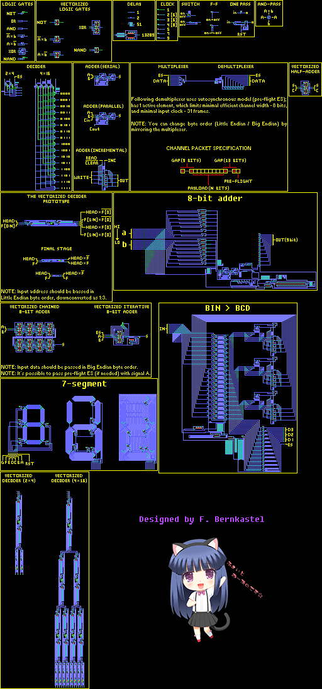
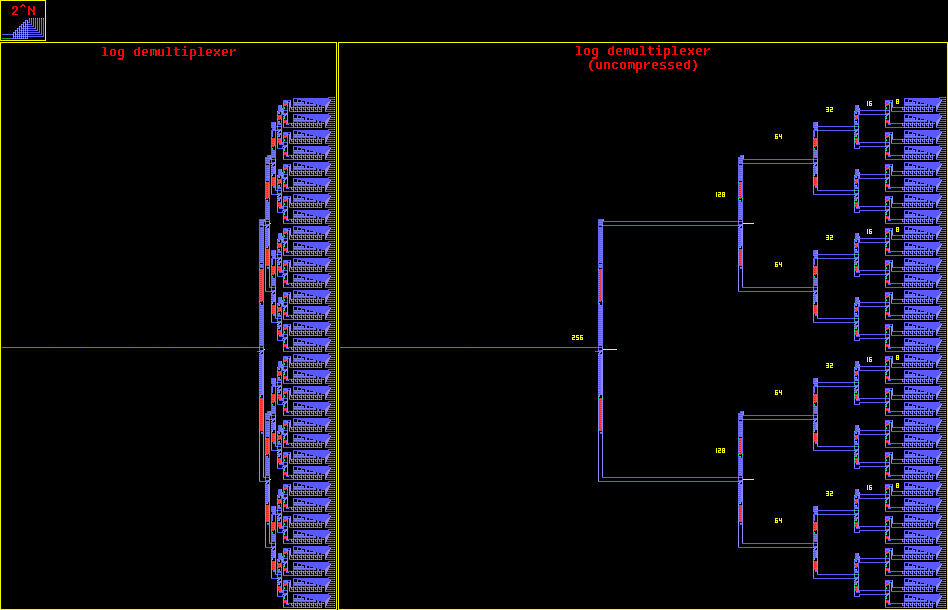

**Hutton32b** - (almost) backward compatible modification of Hutton32 CA. [[Ruletable](doc/Hutton32b.rule)] 
- The `<25,10,11,12,9>` state (and rotations) will now work as a very small (3x3) XNOR logic gate.
- Added forgotten set of rules `<21,0,0,0,28,21>`, to make the special transitive state consistent with the regular one. It will receive signal, even if can't transmit one.

[`1. elementary basis:`](circuits-sandbox.rle)

   
[`2. 8-bit decimal counter:`](advanced%20counter.mc)

   
[`3. 16x16 display:`](big%20sandbox/16x16%20display.mc)

   
[`4. Efficient ROM and address decoder:`](16x16%20movie/16x16%20movie.mc)

   
[`5. Efficient demultiplexer:`](misc/efficient_demultiplexer.mc)

