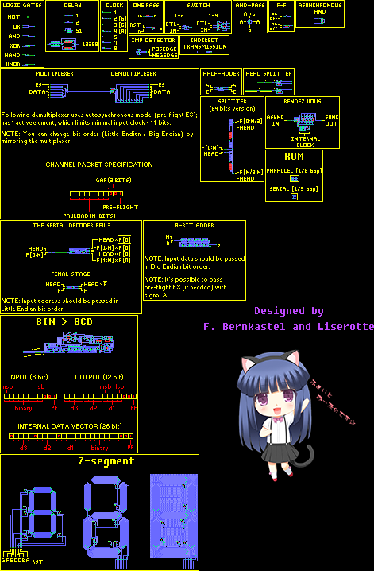
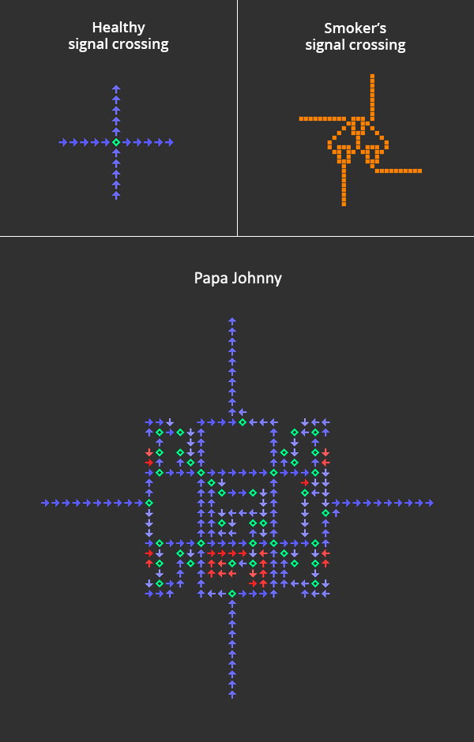

**Hutton32b** - (almost) backward compatible modification of Hutton32 CA. [[Ruletable](doc/Hutton32b.rule)] 
- The `<25,10,11,12,9>` state (and rotations) will now work as a very small (3x3) XNOR logic gate.
- Added forgotten set of rules `<21,0,0,0,28,21>`, to make the special transitive state consistent with the regular one. It will receive signal, even if can't transmit one.
- Added forgotten set of rules `<29,12,9,0,13,25>`.

[`Component basis:`](component-basis.rle)

   
[`8-bit decimal counter:`](advanced%20counter%20v2%20(synchronous%20ver.).rle)

   
[`16x16 display:`](misc/parallel%20display%20(16x16).mc)

.png)
   
[`32x32 display (serial interface):`](misc/serial%20display%20(32x32).mc)

.png)
   
[`Efficient ROM and address decoder:`](misc/Segmented%20ROM%20(256k).mc)

.png)
   
[`Efficient demultiplexer:`](misc/efficient_demultiplexer.mc)

   
### Memories of the Hutton wars

